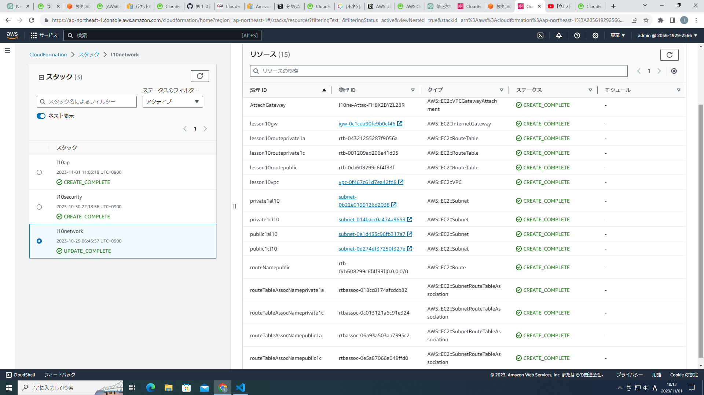
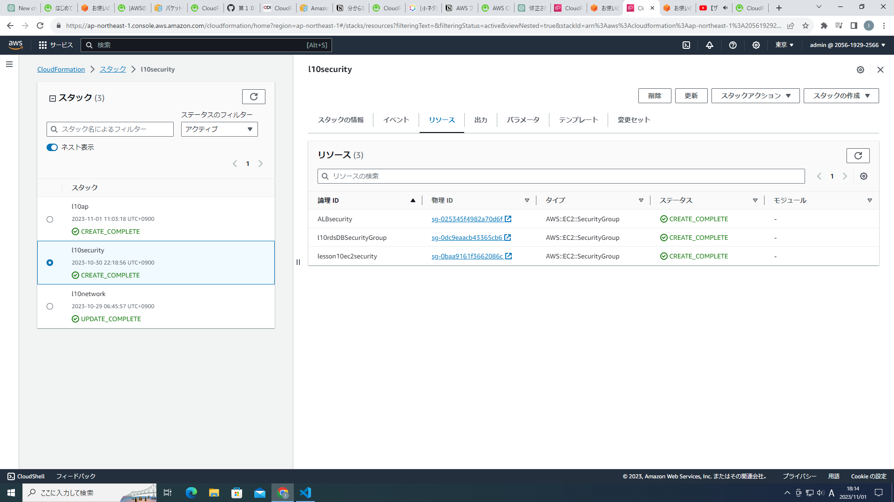
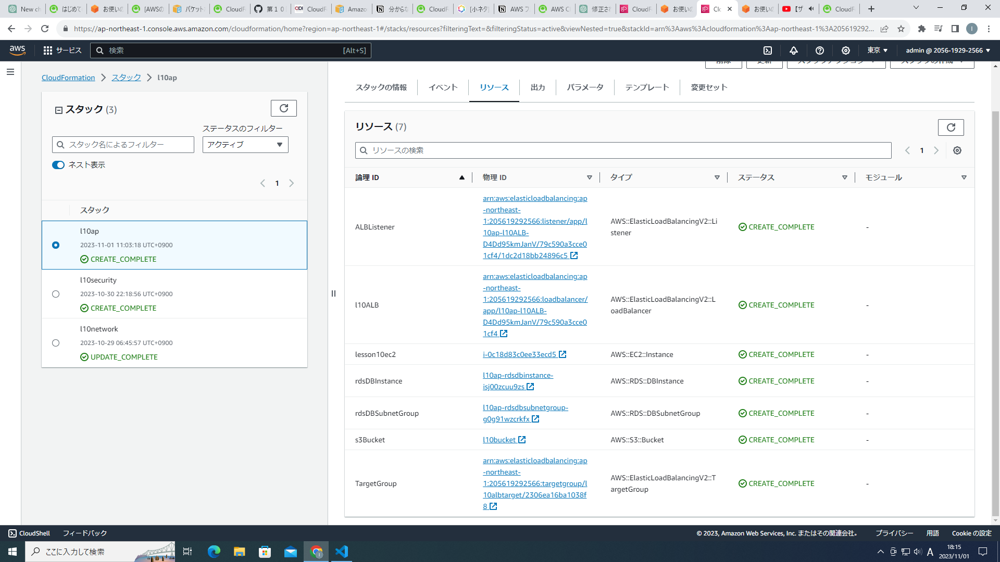
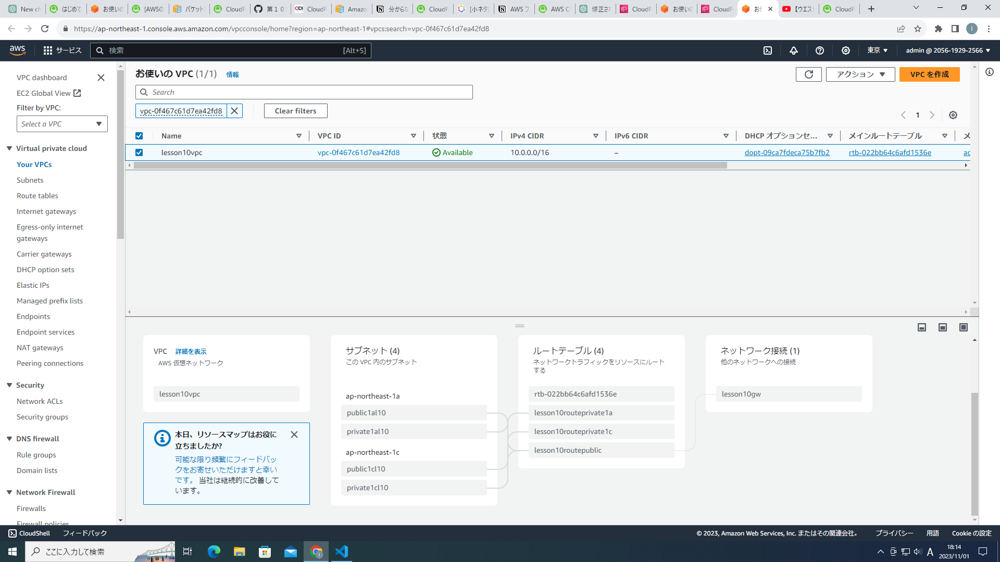
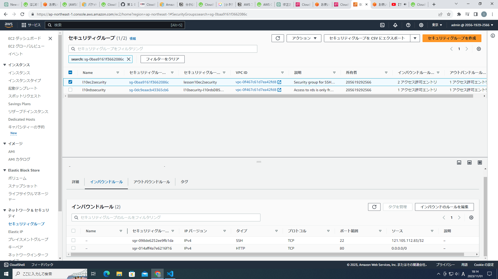
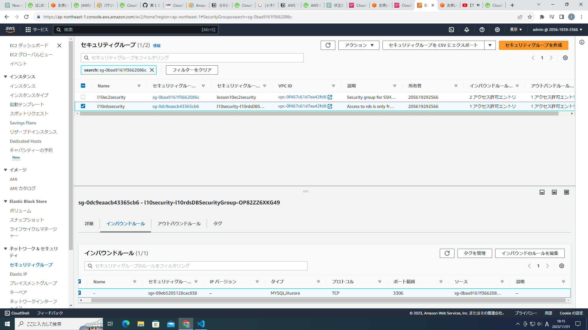
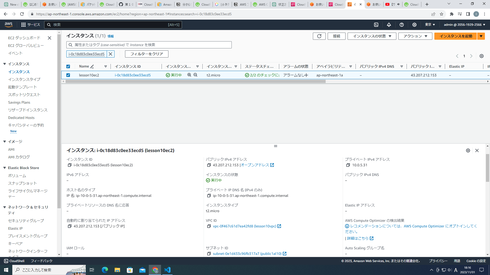
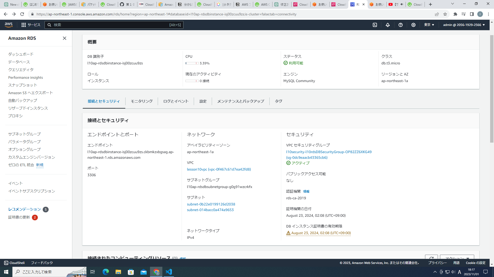
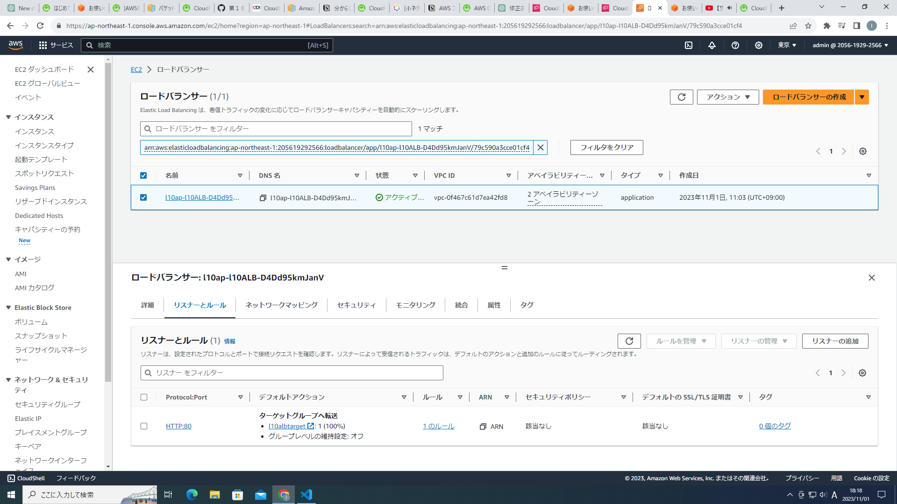
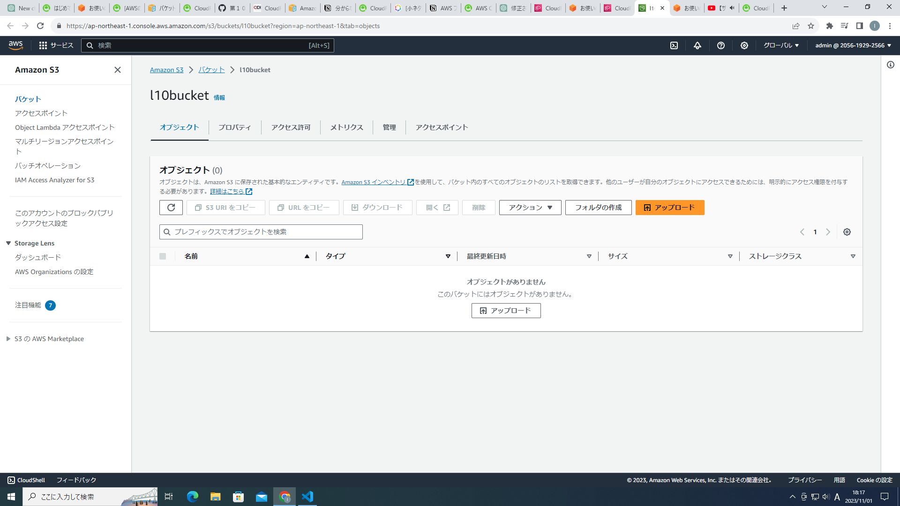

# CloudFormationによる環境のコード化  
CloudFormationにより、第五回課題の環境を構築しました。　　

CloudFormationテンプレートはスタック分割を行い、以下の3層構造にしました。  
1. application layer
2. security layer
3. network layer  
* CloudFormationテンプレートのコードは**l10cloud-formation**ディレクトリに保存しました。  

以下にスタック作成したときにできたリソースの画像を添付します。

# 構築された環境
- スタック作成でできたリソース群

- vpc

- ec2のセキュリティグループ

- rdsのセキュリティグループ

- albのセキュリティグループ
 
- 作成されたec2

- 作成されたrds

- 作成されたalbのリスナーとルール

- albのターゲットグループ
　 
- 作成されたs3

