# CloudFormationによる環境のコード化  
CloudFormationにより、第五回課題の環境を構築しました。　　

CloudFormationテンプレートはスタック分割を行い、以下の3層構造にしました。  
1. Application Layer
2. Security Layer
3. Network Layer  
* CloudFormationテンプレートのコードは**l10cloud-formation**ディレクトリに保存しました。  

以下にスタック作成したときにできたリソースの画像を添付します。

# 構築された環境
- スタック作成でできたリソース群
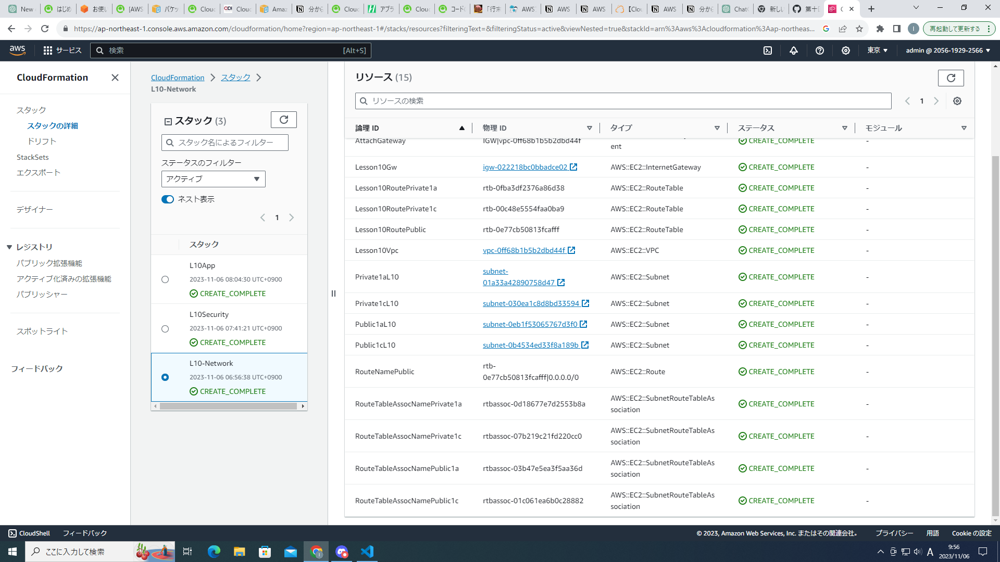
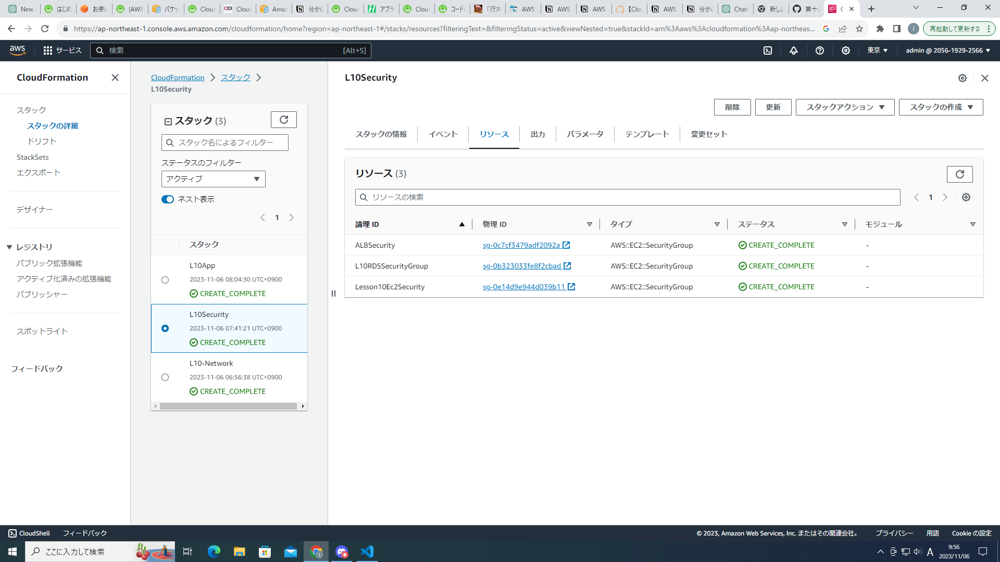
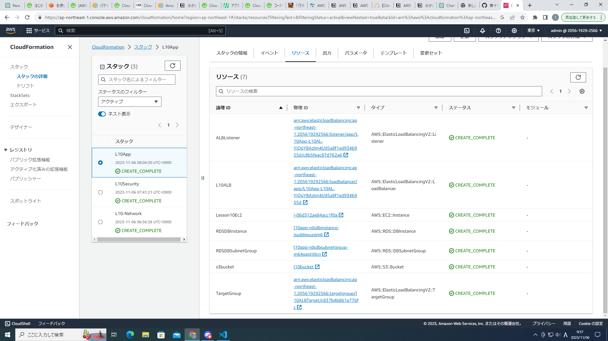
- VPC
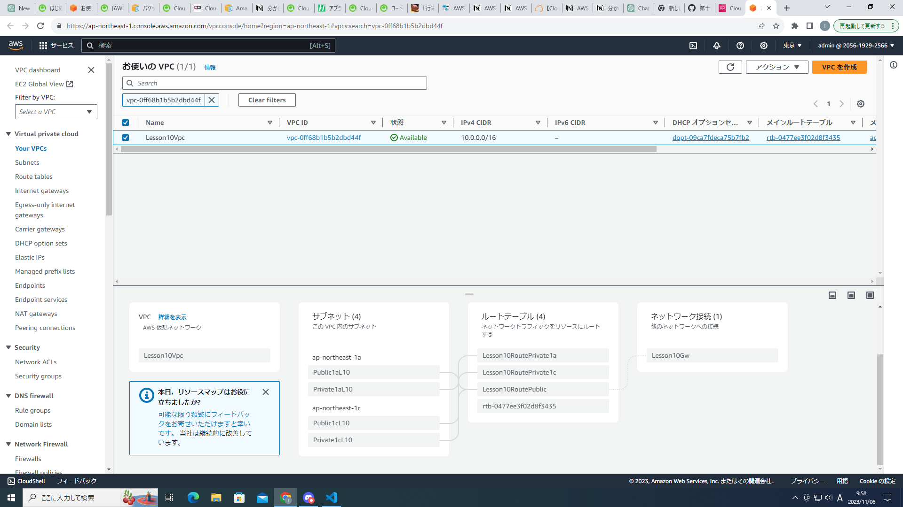
- EC2のセキュリティグループ
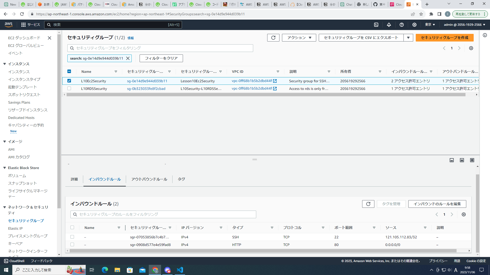
- RDSのセキュリティグループ
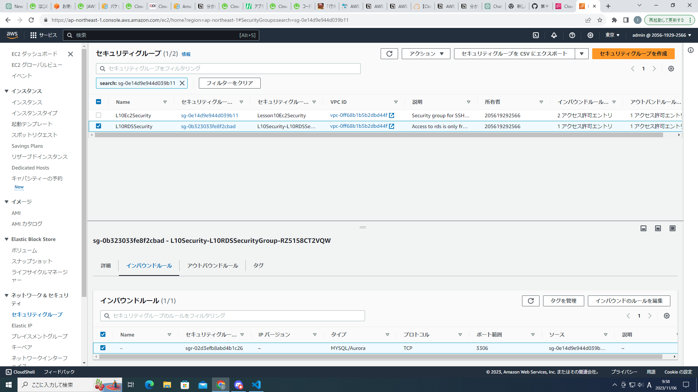
- ALBのセキュリティグループ
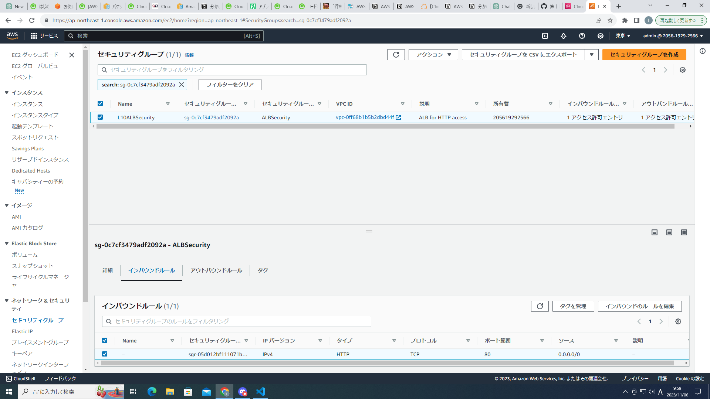
- 作成されたEC2
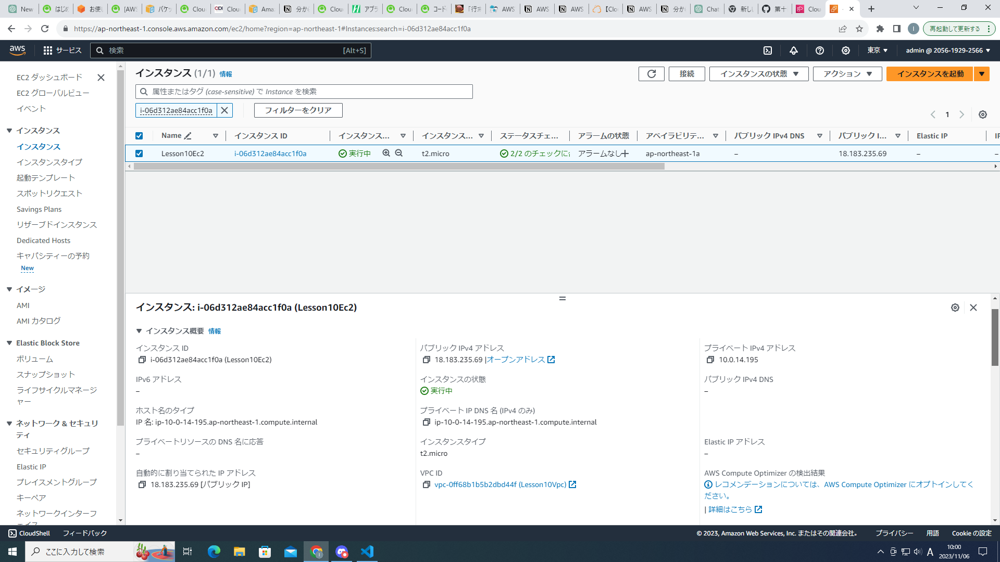
- 作成されたRDS

- 作成されたALBのリスナーとルール
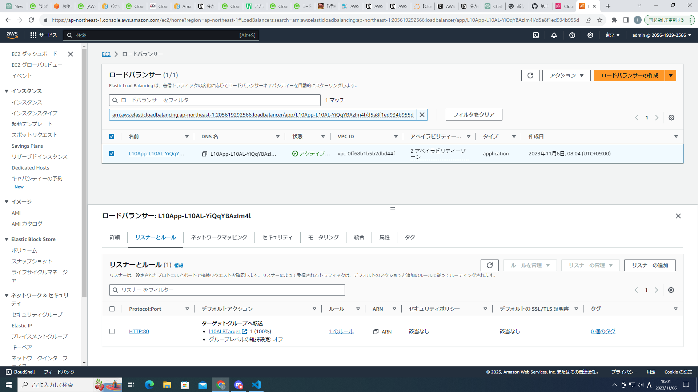
- ALBのターゲットグループ
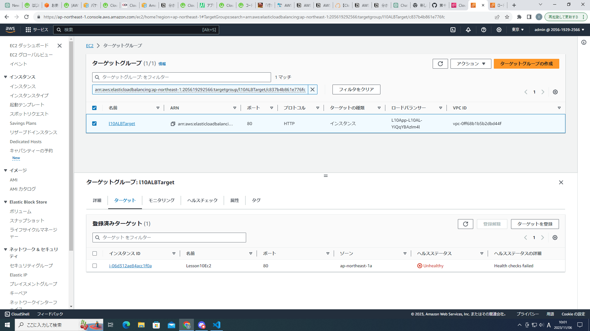
- 作成されたS3
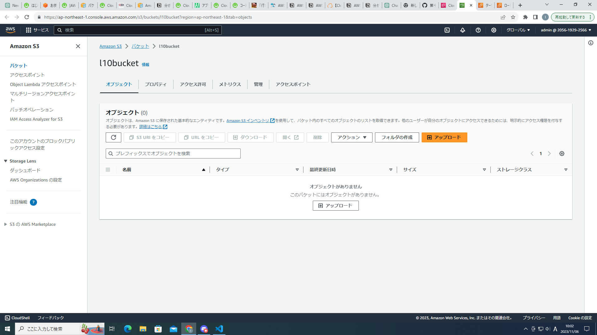
