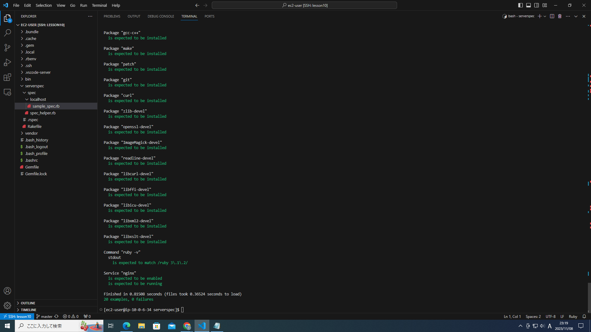

# 第十一回課題
第十回課題で作成したEC2に環境を構築して、ServerSpecでのテストを行いました.  
テストした項目は以下の通りです  
1. nginxがインストールされているか？
2. 80番ポートで待ち受けできているか？
3. 80番ポートにアクセスし、ステータスコードの200番が返ってくるか？
4. 第五回課題で使用したパッケージ群がインストールされているか？
5. 所定のrubyのバージョンになっているか？
6. nginxは自動起動になっているか？

ServerSpecのテストに成功　　
### テストコード
```require 'spec_helper'

listen_port = 80

describe package('nginx') do
  it { should be_installed }
end

describe port(listen_port) do
  it { should be_listening }
end

describe command('curl http://127.0.0.1:#{listen_port}/_plugin/head/ -o /dev/null -w "%{http_code}\n" -s') do
  its(:stdout) { should match /^200$/ }
end

%w{gcc-c++ make patch git curl zlib-devel openssl-devel ImageMagick-devel readline-devel libcurl-devel libffi-devel libicu-devel libxml2-devel libxslt-devel}.each do |pkg|
  describe package(pkg) do
    it { should be_installed }
  end
end

describe command('ruby -v') do
  its(:stdout) { should match /ruby 3\.1\.2/ }
end

describe service('nginx') do
  it { should be_enabled }
  it { should be_running }
end
```
