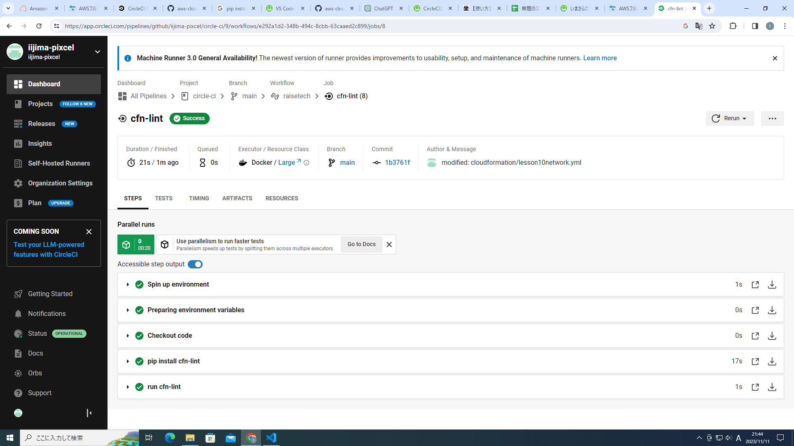

# CircleCIの動作確認テスト　　
新規のリポジトリを作成して、第十二回講義でのサンプルコンフィグを使用したCircleCIの動作確認テストを行いました。   

1. 新規リポジトリを作成後、リポジトリにcircleciディレクトリとconfig.ymlを作成　
2. CircleCIからプロジェクトのセットアップを実行　　
3. リポジトリにcloudformationディレクトリとテストするテンプレートを作成(テンプレートは十回課題のものを使用。またテスト時にエラーが発生したのでAvailabilityZoneを動的な値に変更。)
4. gitにpushして、CircleCIのプロジェクトが動作完了することを確認　　
　　
CircleCIの動作テスト成功　　
### 使用したコンフィグとテンプレート　　
・.circleci\config.yml　　 
・cloudformation/lesson10networkCi.yml  
