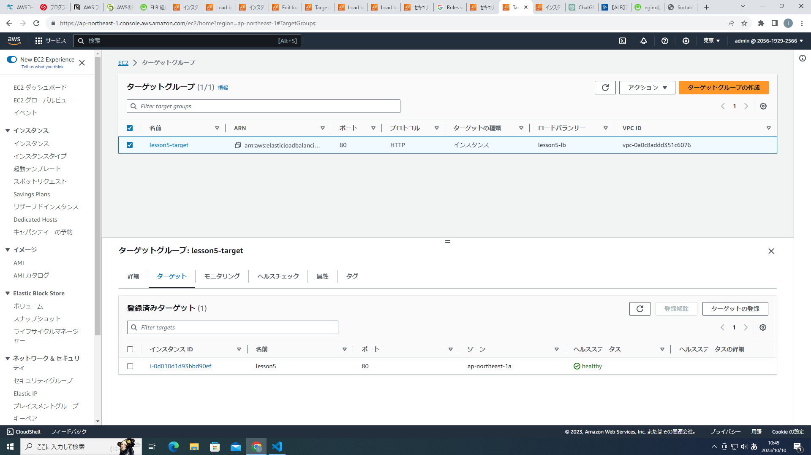

# 第五回課題
1. 組み込みサーバでの動作確認
- サンプルアプリを動作させるためのソフトをインストール
- datebase.ymlにRDSのエンドポイント、ユーザー、パスワードを入力

pumaによるアプリの起動

2. nginx＋uniconによる動作確認
- unicornの設定でsockファイル、pidファイルを作る場所を指定。
- ec2の80番ポートを解放。　　　　
- Nginx設定ファイルに、80番ポート使用、接続するec2のipアドレス、rootディレクトリを設定
- パーミッションの変更を行い、サンプルアプリをnginxユーザーで書き込み、実行できるようにする

　
ブラウザでのhttp接続に成功

3. ALBの追加
- ロードバランサーを作成後、ターゲットグループをec2に設定。

ec2とロードバランサーのステータスの確認

ALBのドメインでの接続確認

4. S3の追加
- Active StorageによるS3への画像の保存をする
- config/storage.ymlにS3のバケット、リージョン、access_key_id、
  secret_access_keyを入力
- 保存先をS3に設定

サンプルアプリで画像を保存する

バケットにファイルが保存されていることを確認

バケットのファイル内容

5. AWS構成図  

