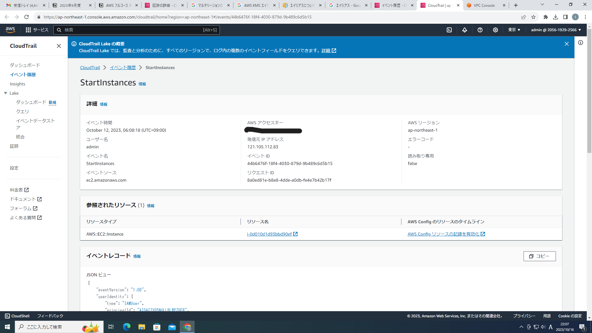
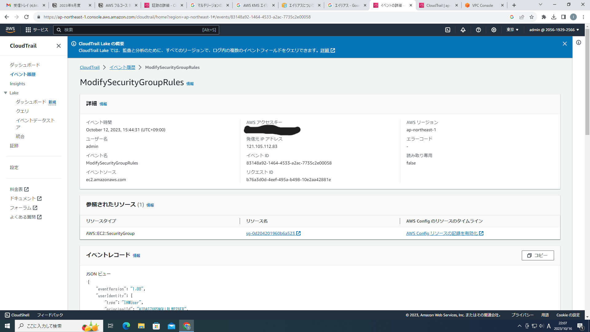
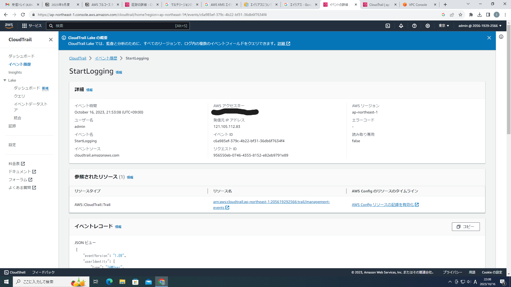
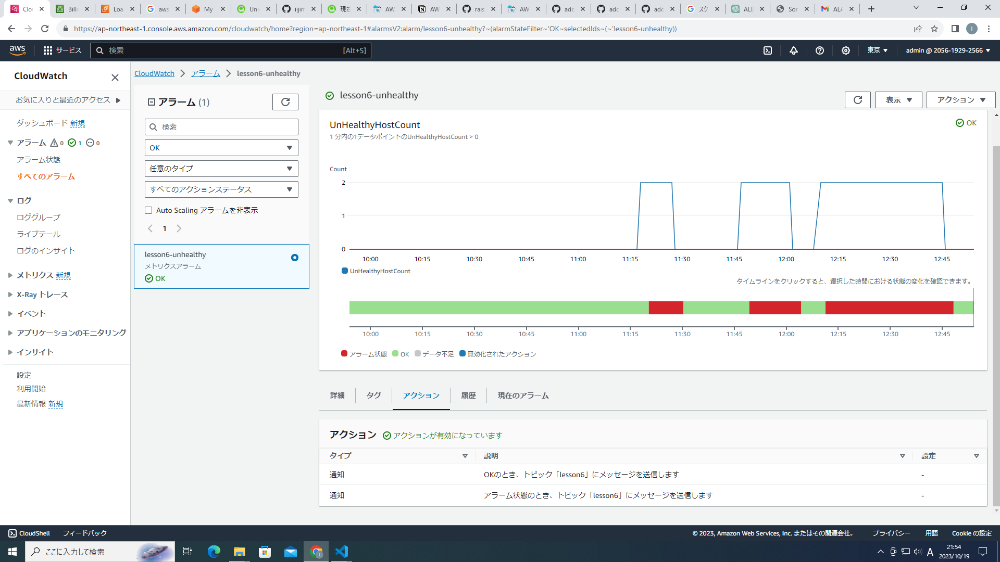
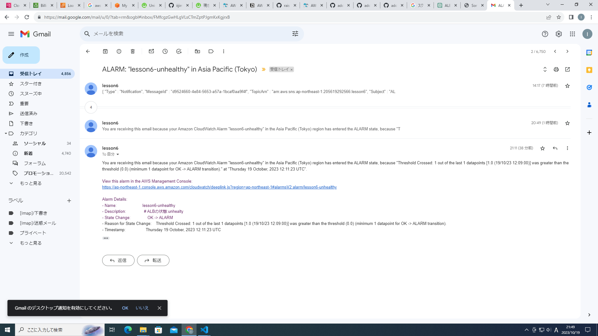
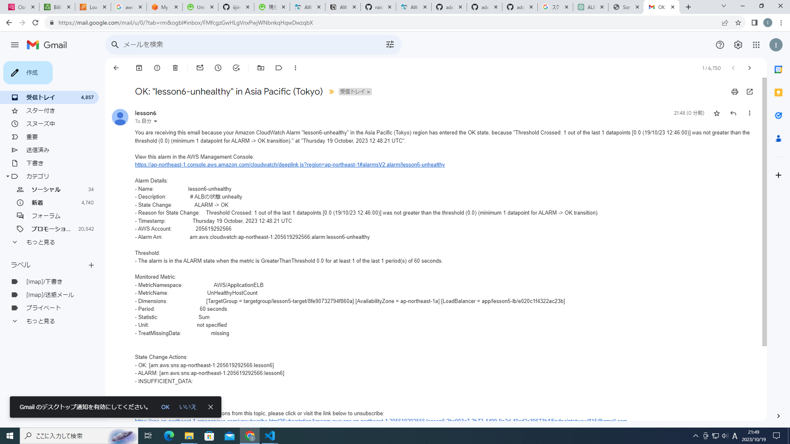

# 第六回課題
1. CloudTrail のイベント情報

lesson5のインスタンスの起動時のイベント情報

セキュリティグループの変更

cloud trailのログ記録の開始

2.  CloudWatchアラームで、ALBのアラームを設定して、メール通知をする

unhealty_countが0以上の時、メールするように設定。また、OKの時もメールするように設定

サンプルアプリを停止し、alarmのメールが来ることを確認。

サンプルアプリを再起動し、OKのステータスになったことの確認のメールがくる。

3. AWS 利用料の見積  
https://calculator.aws/#/estimate?id=c439b06c107373119a66453739196aaed37f758b

4. AWSの利用料

先月分のec2の請求

今月の請求　Elastic IPアドレスの分、無料利用枠を超えている